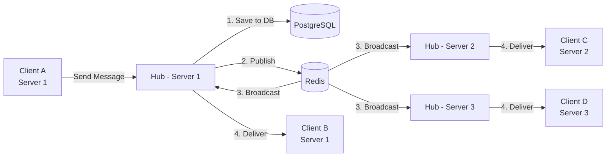

# distributed-fanout

A horizontally scalable message fan-out system built in Go. Messages published by any node are delivered to all subscribers across the cluster in real time, with persistence and cross-server broadcast handled transparently.

## How it works

When a client publishes a message, the server saves it to PostgreSQL and publishes it to a Redis channel. Every server instance in the cluster subscribes to the same Redis channels, so the message fans out to all connected clients regardless of which server they're on.



Clients connect over WebSocket. Channels (called "rooms") are the unit of fan-out — subscribing to a channel means receiving every message published to it, from any server in the cluster.

## Architecture

**Transport layer** — WebSocket connections, JWT auth, per-client rate limiting, HTML sanitization.

**Hub** — Central coordinator per server instance. Tracks local clients, manages channel subscriptions, routes inbound messages to Redis and outbound messages to local sockets.

**Fan-out layer** — Redis Pub/Sub. Each server subscribes to a Redis channel when the first local client joins it, and unsubscribes when the last leaves. Broadcast is fire-and-forget; persistence happens before publish.

**Persistence** — PostgreSQL via GORM. Stores users, channels, membership, and full message history. New subscribers receive history on join.

## Endpoints

| Method | Path | Description |
|--------|------|-------------|
| POST | `/sign-up` | Register |
| POST | `/login` | Authenticate, receive JWT |
| GET | `/health` | Health check |
| GET | `/api/rooms` | List channels |
| POST | `/api/room/create` | Create channel |
| POST | `/api/room/join` | Subscribe to channel |
| GET | `/api/room/history` | Fetch message history |
| WS | `/ws?token=<jwt>&id=<client_id>` | Open fan-out connection |

## WebSocket message types

**Inbound** — `join_room`, `leave_room`, `room_message`, `private_message`, `typing`

**Outbound** — `room_joined`, `room_message`, `user_joined_room`, `error`

## Stack

Go · gorilla/websocket · PostgreSQL + GORM · Redis · JWT · Docker

## Running locally

```sh
# Backend
docker compose up --build

# Frontend (React + TypeScript)
cd frontend && npm install && npm run dev
```
