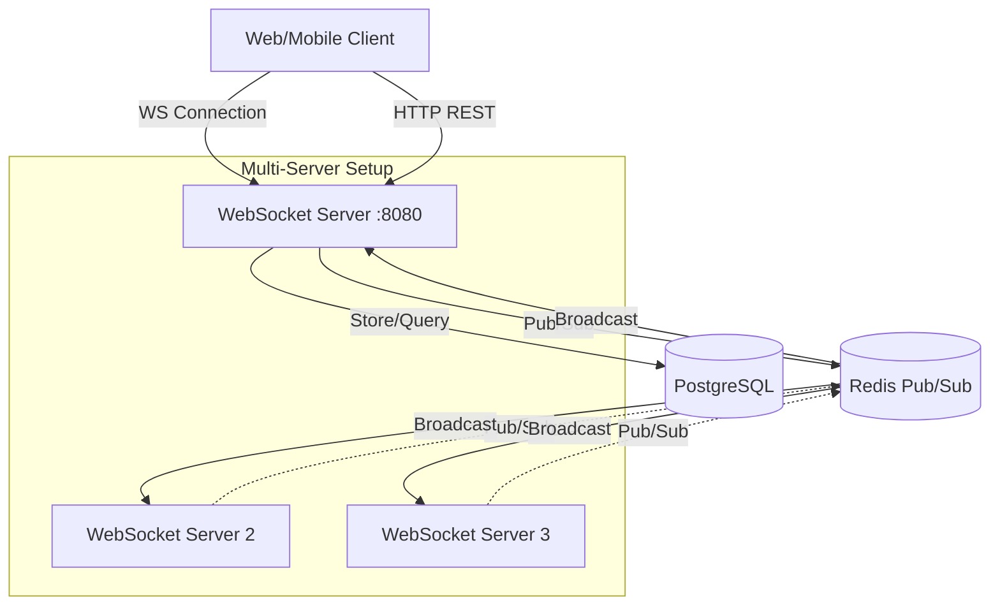
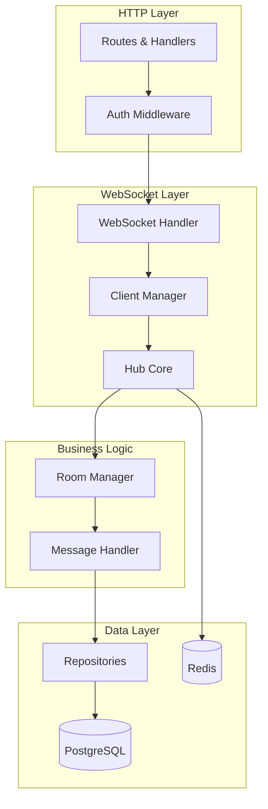
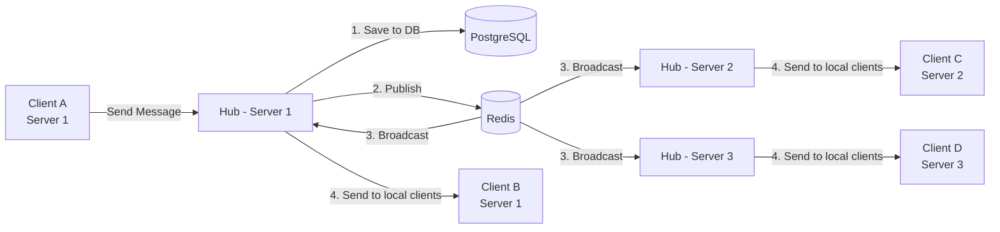
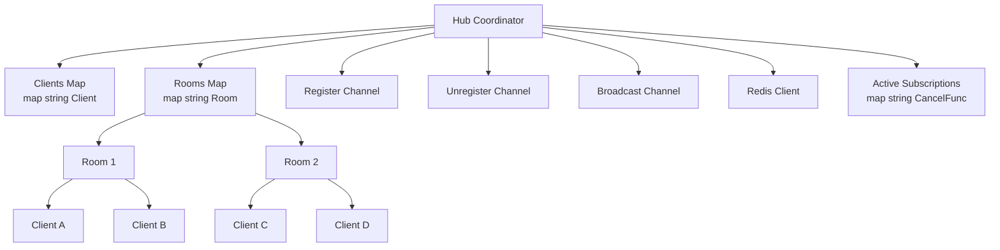

# WebSocket Chat System

A scalable real-time chat system built with Go, WebSocket, Redis pub/sub, and PostgreSQL. Supports multiple servers with horizontal scaling.

## Features

### Core Features
- Real-time messaging with WebSocket connections
- Multi-room chat support
- Private messaging between users
- Message history persistence
- Typing indicators
- User authentication with JWT
- Multi-server deployment with Redis pub/sub

### Security
- JWT-based authentication
- Password hashing with bcrypt
- Protected REST API endpoints
- Token validation for WebSocket connections
- HTML sanitization to prevent XSS
- Input validation and rate limiting ready
- Per-client rate limiting (configurable)

### Scalability
- Horizontal scaling across multiple servers
- Redis pub/sub for cross-server communication
- Connection pooling for database
- Graceful shutdown support
- Room-based message isolation

## Landing Page

https://github.com/user-attachments/assets/0bd24958-a641-4e8a-95b3-538bfb595cd4

## Architecture

### High-Level System Architecture



### Component Architecture



### Message Flow



### Hub Structure



## Tech Stack

- **Language**: Go 1.25
- **WebSocket**: gorilla/websocket
- **Database**: PostgreSQL with GORM
- **Cache/Pub-Sub**: Redis
- **Authentication**: JWT (golang-jwt/jwt)
- **Configuration**: Viper
- **Frontend**: React, TypeScript, Tailwind CSS v4
- **Containerization**: Docker, Docker Compose

## Project Structure

```
websocketGo/
├── cmd/
│   └── server/
│       └── main.go              # Application entry point
├── internal/
│   ├── common/
│   │   ├── hub.go              # WebSocket hub coordinator
│   │   ├── client.go           # Client structure
│   │   ├── room.go             # Room management
│   │   └── config.go           # Configuration
│   ├── middleware/
│   │   ├── auth.go             # JWT authentication
│   │   └── cors.go             # CORS middleware
│   ├── repository/
│   │   ├── user_repo.go        # User data access
│   │   ├── chat_repo.go        # Chat data access
│   │   └── room_repo.go        # Room data access
│   ├── server/
│   │   ├── handlers.go         # WebSocket handlers
│   │   ├── authHandler.go      # Auth endpoints
│   │   ├── protectedHandlers.go # Protected REST API
│   │   ├── client.go           # Client message handling
│   │   └── models/             # Database models
│   └── storage/
│       ├── postgres.go         # PostgreSQL connection
│       └── redis.go            # Redis connection
├── frontend/
│   └── src/
│       ├── components/
│       │   ├── Auth/            # Login, Signup
│       │   ├── Chat/            # Sidebar, ChatArea, MessageBubble
│       │   ├── Layout/          # MainLayout
│       │   └── Modals/          # CreateRoomModal, JoinRoomModal
│       ├── context/             # AuthContext
│       ├── hooks/               # useChatSocket
│       ├── services/            # API client
│       └── types/               # TypeScript interfaces
├── docker-compose.yml
├── Dockerfile
├── config.yaml                 # Configuration file
└── go.mod
```

## API Endpoints

### Public Endpoints

| Method | Endpoint | Description |
|--------|----------|-------------|
| POST | `/sign-up` | Create new user account |
| POST | `/login` | Login and get JWT token |
| GET | `/health` | Health check |

### Protected Endpoints (Require JWT)

| Method | Endpoint | Description |
|--------|----------|-------------|
| GET | `/api/profile` | Get user profile |
| GET | `/api/rooms` | List all rooms |
| GET | `/api/room/history` | Get room message history |
| POST | `/api/room/create` | Create new chat room |
| POST | `/api/room/join` | Join an existing room |
| POST | `/api/auth/refresh` | Refresh JWT token |

### WebSocket Endpoint

```
WS /ws?token=<jwt_token>&id=<client_id>
```

## WebSocket Message Types

### Client to Server

**Join Room**
```json
{
  "type": "join_room",
  "room": "room_id"
}
```

**Send Message**
```json
{
  "type": "room_message",
  "room": "room_id",
  "content": "Hello World"
}
```

**Leave Room**
```json
{
  "type": "leave_room",
  "room": "room_id"
}
```

**Typing Indicator**
```json
{
  "type": "typing",
  "room": "room_id"
}
```

**Private Message**
```json
{
  "type": "private_message",
  "to": "user_id",
  "content": "Hello"
}
```

### Server to Client

**Room Joined**
```json
{
  "type": "room_joined",
  "room": "room_id",
  "members": ["user1", "user2"]
}
```

**New Message**
```json
{
  "type": "room_message",
  "room": "room_id",
  "content": "Hello World",
  "sender": 123,
  "sender_id": "client_456",
  "message_id": 789,
  "timestamp": 1234567890
}
```

**User Joined**
```json
{
  "type": "user_joined_room",
  "room": "room_id",
  "userId": "client_123"
}
```

**Error**
```json
{
  "type": "error",
  "error": "Error message"
}
```

## How It Works

### 1. Client Connection
- Client connects to WebSocket with JWT token
- Server validates token and creates client session
- Client is registered with the Hub

### 2. Joining a Room
- Client sends join_room message
- Hub creates room if it doesn't exist
- Hub subscribes to Redis channel for that room
- Client receives room history from database
- Other room members are notified

### 3. Sending Messages
- Client sends room_message
- Server saves message to PostgreSQL
- Server publishes message to Redis channel
- Redis broadcasts to all server instances
- Each server sends to its local room clients

### 4. Multi-Server Scaling
- Multiple server instances connect to same Redis
- Each server maintains its own client connections
- Redis pub/sub synchronizes messages across servers
- Database stores persistent message history

### 5. Room Management
- Rooms are created via REST API and stored in PostgreSQL
- Creating a room automatically adds the creator as a member
- Users can join rooms via the `/api/room/join` endpoint
- Room membership is tracked in the `room_members` table

## Running Locally

### Backend (Docker)

```sh
docker compose up --build
```

### Frontend

```sh
cd frontend
npm install
npm run dev
```
